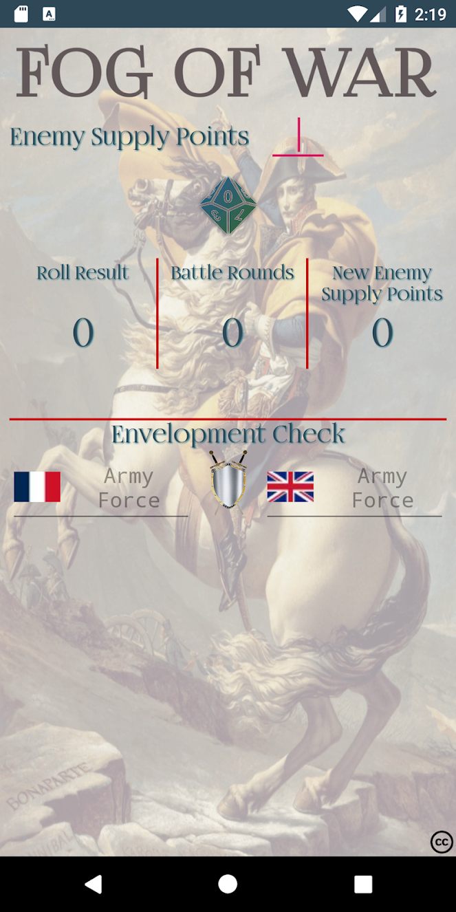

# Field Commander Napoleon Helper App
Helper app for the boardgame [Field Commander Napoleon](https://www.mcssl.com/store/danverssengames/vassal/pdf-games/1-players/field-commander-napoleon)

It was made as part of my Android development learning path and was made as a favor for the BGG community members.

You can download the app from [Google Play](https://play.google.com/store/apps/details?id=il.co.woo.fieldcommandernapoleon&hl=en_AU) to understand how it works or use the code freely to learn how to animate your own app.

 

